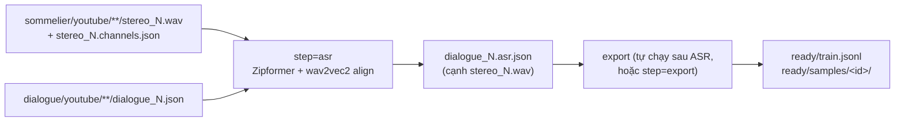

# Hướng dẫn: ASR + Export từ stereo Sommelier sang data cho mô hình

Dùng khi đã có output stereo ở `outputs/processed/sommelier/youtube` nhưng chưa chạy ASR.
Kết quả cuối cùng là `outputs/processed/ready/`, đúng định dạng trong [prepared_data.md](prepared_data.md).



Mọi lệnh chạy từ **thư mục gốc dự án** (`cisco/`).

## 1. Kiểm tra đầu vào

ASR của Sommelier cần đủ 3 loại file cho mỗi mẫu:

| File | Vị trí | Vai trò |
|---|---|---|
| `stereo_N.wav` | `outputs/processed/sommelier/youtube/<video>/` | stereo 24 kHz, 2 kênh |
| `stereo_N.channels.json` | cạnh `stereo_N.wav` | tên speaker của kênh 0/1 (phải là 2 tên khác nhau) |
| `dialogue_N.json` | `outputs/processed/dialogue/youtube/<video>/` (**cùng đường dẫn con** với stereo) | speaker turns từ bước split dialogue |

```bash
find outputs/processed/sommelier/youtube -name "stereo_*.wav" | wc -l
find outputs/processed/sommelier/youtube -name "stereo_*.channels.json" | wc -l
find outputs/processed/dialogue/youtube -name "dialogue_*.json" | wc -l
```

Ba số này nên bằng nhau (số dialogue có thể lớn hơn). Mẫu nào thiếu file sẽ bị đánh dấu `failed` trong `asr_report.json`.

## 2. Môi trường ASR (riêng, không đụng môi trường tổng)

```bash
conda create -n asr python=3.12 -y
conda activate asr
python -m pip install --upgrade pip setuptools wheel
python -m pip install -r requirements-asr.txt
which python   # ví dụ: /home/<user>/miniconda3/envs/asr/bin/python  -> dùng cho asr.python
```

Có thể chạy `run_pipeline.py` ngay trong env `asr` (env này đã có `hydra-core`/`omegaconf`), khi đó không cần `asr.python=...`.

## 3. Model local (`env=sever`, offline)

Mặc định model nằm dưới `${env.paths.base_models}` (xem `configs/env/sever.yaml`):

| Model | Đường dẫn mặc định |
|---|---|
| Zipformer (ONNX + `bpe.model`) | `<base_models>/Zipformer-30M-RNNT-6000h/` |
| Aligner wav2vec2 | `<base_models>/wav2vec2-base-vi-vlsp2020/` (`config.json` + weights) |
| Silero VAD | `<base_models>/silero-vad` |

Nếu thư mục model ở chỗ khác thì thêm `env.paths.base_models=/path/to/models`. Nếu chưa có model và máy có mạng, dùng `env=dev` để tải từ Hugging Face.

## 4. Dry-run để xem lệnh và đường dẫn

`env=sever` mặc định trỏ data về thư mục server. Vì data đang nằm trong `outputs/processed` của repo, override `data.base_output_dir`:

```bash
python run_pipeline.py step=asr pipeline=sommelier env=sever data.source=youtube \
  data.base_output_dir=outputs/processed dry_run=true
```

Kiểm tra trong lệnh in ra:
- `--stereo-root outputs/processed/sommelier/youtube`
- `--dialogue-root outputs/processed/dialogue/youtube`
- `"export": {... "out_dir": "outputs/processed/ready" ...}`

## 5. Chạy ASR + Export

```bash
python run_pipeline.py step=asr pipeline=sommelier env=sever data.source=youtube \
  data.base_output_dir=outputs/processed gpu=0
```

Nếu chạy từ một env khác env `asr`:

```bash
python run_pipeline.py step=asr pipeline=sommelier env=sever data.source=youtube \
  data.base_output_dir=outputs/processed gpu=0 \
  asr.python=/home/<user>/miniconda3/envs/asr/bin/python
```

Lệnh trên làm hai việc:
1. **ASR**: ghi `dialogue_N.asr.json` cạnh từng `stereo_N.wav` và `outputs/processed/sommelier/youtube/asr_report.json`. Chạy lại sẽ **resume**: mẫu đã xong và không đổi input/config thì hiện `[RESUMED]`.
2. **Export** (`asr.export.enabled=true`, mặc định bật): tạo `outputs/processed/ready/`.

Tuỳ chọn giải mã chính xác hơn (chậm hơn):

```bash
  asr.zipformer.decoding_method=modified_beam_search asr.zipformer.max_active_paths=8
```

## 6. Chỉ chạy lại Export (không chạy lại ASR)

Dùng khi muốn đổi prompt, swap vai hoặc tham số voice prompt. Sửa các tham số `asr.export.*` **không** làm ASR chạy lại.

```bash
python run_pipeline.py step=export pipeline=sommelier env=sever data.source=youtube \
  data.base_output_dir=outputs/processed
```

Ví dụ đổi prompt và đảo vai (kênh phải thành agent):

```bash
python run_pipeline.py step=export pipeline=sommelier env=sever data.source=youtube \
  data.base_output_dir=outputs/processed \
  asr.export.swap_roles=true \
  "asr.export.text_prompt_left='Bạn là trợ lý ảo tiếng Việt, trả lời tự nhiên, ngắn gọn.'" \
  "asr.export.text_prompt_right='Bạn là khách hàng hỏi thông tin.'"
```

Muốn ghi ra thư mục khác: `asr.export.out_dir=/path/to/ready_v2`.

Hoặc gọi script trực tiếp, không qua Hydra:

```bash
python scripts/export_prepared.py \
  --stereo-root outputs/processed/sommelier/youtube \
  --out-dir outputs/processed/ready \
  --config-json '{"swap_roles": false, "text_prompt_left": "Bạn là trợ lý thân thiện."}'
```

### Tham số export (`configs/asr/default.yaml`)

| Key | Mặc định | Ý nghĩa |
|---|---|---|
| `asr.export.enabled` | `true` | Tự export sau `step=asr` |
| `asr.export.out_dir` | `${data.base_output_dir}/ready` | Thư mục prepared |
| `asr.export.swap_roles` | `false` | `false`: kênh trái = agent; `true`: đảo kênh để người bên phải thành agent |
| `asr.export.language` | `vi` | Ghi vào `metadata.json` |
| `asr.export.text_prompt_left` | `Bạn là trợ lý thân thiện.` | Persona của agent |
| `asr.export.text_prompt_right` | `Bạn là khách hàng hỏi thông tin.` | Persona của kênh phải |
| `asr.export.voice_prompt.min_seconds` / `max_seconds` | `5.0` / `10.0` | Độ dài giọng mẫu |
| `asr.export.voice_prompt.min_gap_to_other` | `0.3` | Khoảng cách tối thiểu (s) tới lượt nói của người kia |

## 7. Kết quả

```text
outputs/processed/ready/
├── train.jsonl            # {"sample_id", "sample_dir": "samples/<id>", "duration"}
├── export_report.json     # kept / rejected + lý do từng mẫu
└── samples/<video>__stereo_N/
    ├── conversation.wav        # PCM16, 24 kHz, LEFT = agent, RIGHT = user
    ├── voice_prompt_left.wav   # 5–10 s, chỉ giọng agent
    ├── voice_prompt_right.wav  # nếu tìm được đoạn sạch của kênh phải
    ├── words.json              # [{"speaker": "agent|user", "word", "start", "end"}], sort theo start
    └── metadata.json
```

`metadata.json`:

```json
{
  "sample_id": "vid1__stereo_0",
  "duration_sec": 43.76,
  "language": "vi",
  "agent_channel": "left",
  "user_channel": "right",
  "text_prompt_left": "Bạn là trợ lý thân thiện.",
  "text_prompt_right": "Bạn là khách hàng hỏi thông tin.",
  "voice_prompt_left": "same_conversation",
  "voice_prompt_right": "same_conversation",
  "conversation_id": "vid1__stereo_0",
  "swap_roles": false,
  "source_speakers": {"left": "SPEAKER_00", "right": "SPEAKER_01"}
}
```

### Lý do một mẫu bị loại (`export_report.json` → `reasons`)

| Lý do | Ý nghĩa | Cách xử lý |
|---|---|---|
| `missing_asr` | Chưa có `dialogue_N.asr.json` | Chạy `step=asr` (xem `asr_report.json` nếu ASR lỗi) |
| `invalid_words` | Vi phạm quy tắc `words.json`, thường là **không có từ của agent** | Kiểm tra kênh trái có tiếng không; thử `swap_roles` |
| `no_voice_prompt` | Agent không có đoạn nói một mình ≥ 5 s | Giảm `asr.export.voice_prompt.min_seconds` |
| `invalid_audio` | Stereo không phải 2 kênh, 24 kHz | Chạy lại bước Sommelier |
| `contract` | File ghi ra không qua bước tự kiểm tra | Xem chi tiết trong `items[].reason` |

Quy tắc `words.json` được kiểm tra: `speaker` ∈ {`agent`, `user`}; `word` khác rỗng; `start ≥ 0`; `end > start`; `end ≤ duration + 0.05`; mảng sắp xếp tăng theo `start`; có ít nhất một từ của agent. Timestamp vượt độ dài audio được cắt về `duration` trước khi kiểm tra.

## 8. Kiểm tra nhanh

```bash
python - <<'EOF'
import json
r = json.load(open("outputs/processed/ready/export_report.json"))
print(f"kept={r['kept']} rejected={r['rejected']} hours={r['hours']}")
print(r["reasons"])
EOF
head -3 outputs/processed/ready/train.jsonl
```

Sau đó kiểm tra bên repo trainer (xem mục 8 của [prepared_data.md](prepared_data.md)):

```bash
cd personaplex-finetuning
python -m tools.validate_dataset --config configs/config.yaml data.prepared_dir=/abs/path/cisco/outputs/processed/ready
python -m tools.inspect_sample  --config configs/config.yaml data.prepared_dir=/abs/path/cisco/outputs/processed/ready --index 0
```

Nên nghe thử vài file `conversation.wav` và `voice_prompt_left.wav` để chắc agent nằm ở kênh trái.
